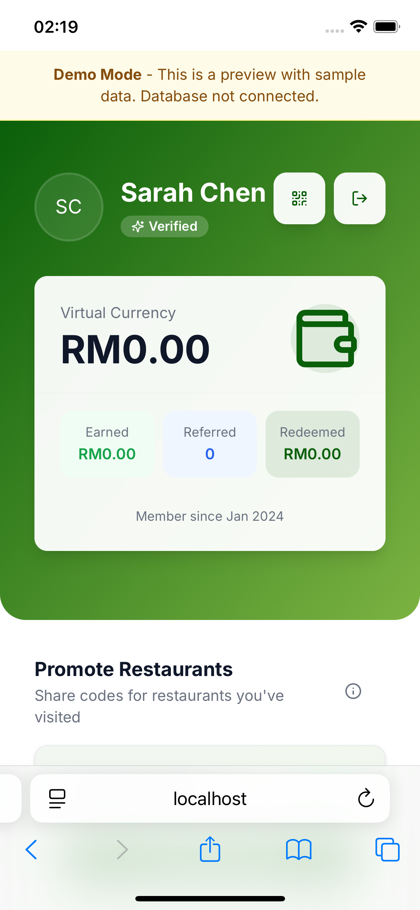
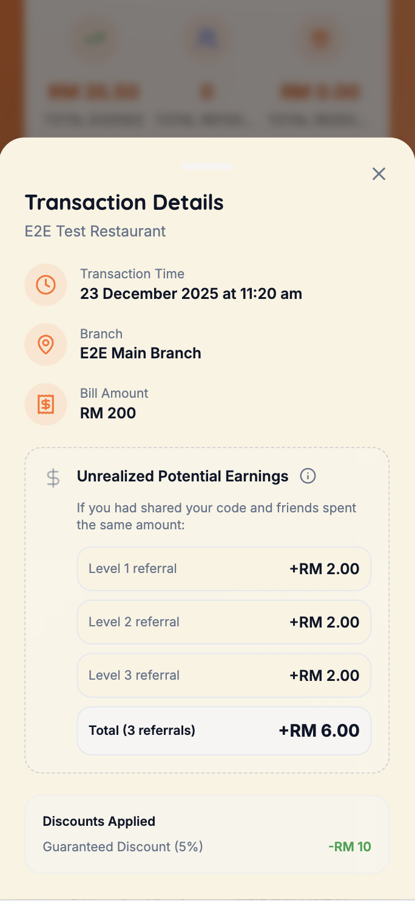
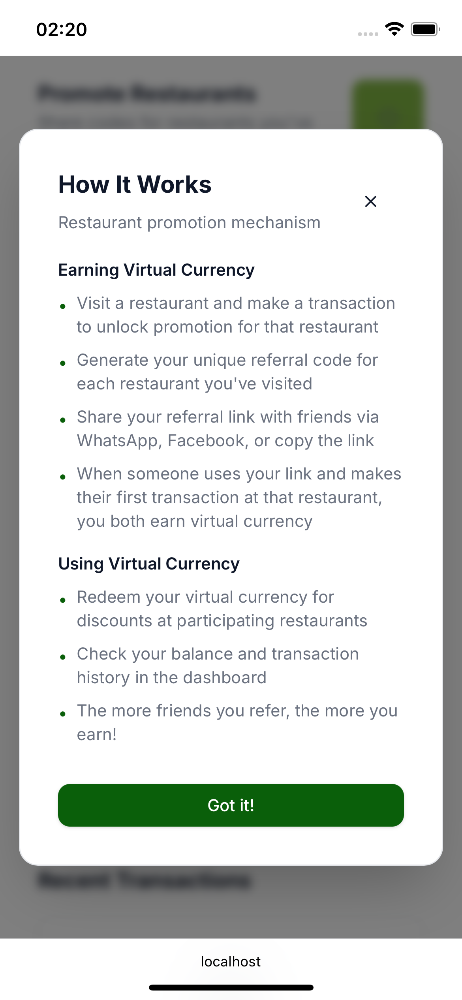
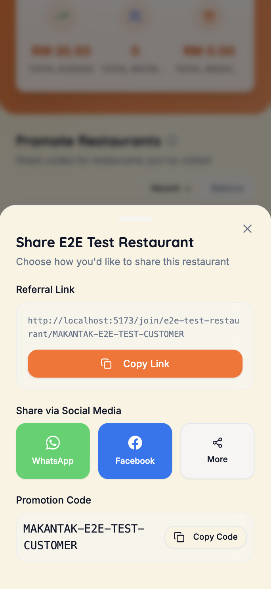

# MakanTak 🍽️

**Full-Stack Restaurant Loyalty Platform** — React • TypeScript • Supabase • PostgreSQL

> **Portfolio Project:** Technical showcase demonstrating full-stack development, database design, and modern web architecture. Proprietary business logic excluded.

---

## 🛠️ Tech Stack

**Frontend:** React 18 • TypeScript • Tailwind CSS • shadcn/ui • Vite • i18n (EN/MS/ZH)  
**Backend:** Supabase • PostgreSQL • Row-Level Security • Edge Functions  
**Tools:** ESLint • Prettier • Git • Vercel

---

## 💡 Key Technical Skills Demonstrated

### Full-Stack Development

- Type-safe React components with TypeScript
- Responsive mobile-first UI with Tailwind CSS
- Multi-language support (English, Bahasa Malaysia, Simplified Chinese)
- Context API for global state management
- RESTful API integration with Supabase client

### Database & Backend

- Complex PostgreSQL schema design with relational integrity
- Row-Level Security (RLS) policies for data isolation
- JWT-based authentication with bcrypt password hashing
- Database views and stored procedures for business logic

### Modern Development Practices

- Component-driven development with shadcn/ui
- Git workflow with feature branches
- ESLint + Prettier for code quality
- Environment-based configuration management

---

## ✨ Core Features

**Authentication System** - JWT tokens, role-based access control, email verification  
**Multi-Language Support** - Full internationalization in English, Bahasa Malaysia, and Simplified Chinese  
**Customer Dashboard** - Restaurant-specific virtual currency tracking, referral management, QR codes  
**Social Sharing** - One-click WhatsApp/Facebook sharing with pre-filled messages  
**Transaction Processing** - QR scanning, AI receipt OCR, real-time calculations  
**Analytics** - Metrics dashboard with reporting and export capabilities

---

## 📱 Screenshots

### Total Virtual Currency Stats

Centralized stats card showing total earnings and savings across all restaurants, giving users a complete overview of their loyalty rewards throughout their app lifecycle.

  
  
<em>Total earned and redeemed VC across all restaurants</em>

### Restaurant-Specific Transaction Details

Minimal transaction details cards displaying transaction details, unrealised VC earnings, and applied discounts.

  
  
<em>Clean transaction details along with unrealised VC earnings displayed</em>

### How It Works Modal

Information modal explaining the restaurant promotion mechanism and virtual currency earning system.

  
  
<em>User guide explaining earning and using virtual currency</em>

### Swipeable Share Bottom Sheet

Mobile-optimized bottom sheet with organized sharing options: referral link, social media buttons (WhatsApp, Facebook), and promotion code.

  
  
<em>Native-feeling swipeable bottom sheet with all sharing options</em>

---

## � Contact

For inquiries or support, reach us at: **<support@makantak.com>**

---

## �📄 License

**Portfolio Project** | Copyright © 2025 | All Rights Reserved

This repository is provided for **viewing and evaluation purposes only**. The code showcases technical skills and development practices. Setup instructions, API keys, and database schemas are intentionally excluded.

**Unauthorized use, copying, modification, or distribution is strictly prohibited.**
