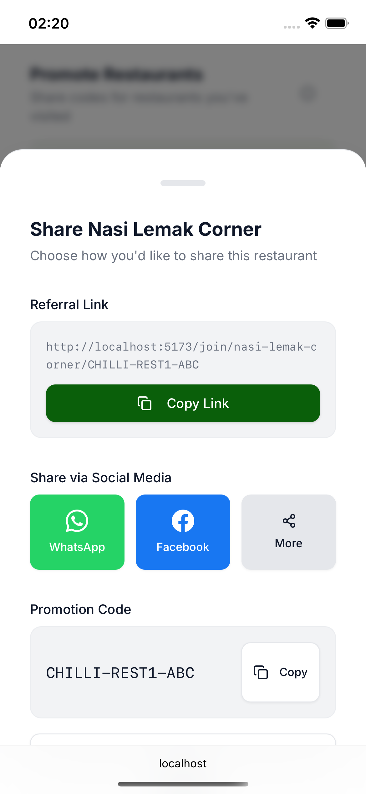

# MalaChilli 🍽️

**Full-Stack Restaurant Loyalty Platform** — React • TypeScript • Supabase • PostgreSQL

> **Portfolio Project:** Technical showcase demonstrating full-stack development, database design, and modern web architecture. Proprietary business logic excluded.

---

## 🛠️ Tech Stack

**Frontend:** React 18 • TypeScript • Tailwind CSS • shadcn/ui • Vite  
**Backend:** Supabase • PostgreSQL • Row-Level Security • Edge Functions  
**Tools:** ESLint • Prettier • Git • Vercel

---

## 💡 Key Technical Skills Demonstrated

### Full-Stack Development
- Type-safe React components with TypeScript
- Responsive mobile-first UI with Tailwind CSS
- Context API for global state management
- RESTful API integration with Supabase client

### Database & Backend
- Complex PostgreSQL schema design with relational integrity
- Row-Level Security (RLS) policies for data isolation
- JWT-based authentication with bcrypt password hashing
- Database views and stored procedures for business logic

### Modern Development Practices
- Component-driven development with shadcn/ui
- Git workflow with feature branches
- ESLint + Prettier for code quality
- Environment-based configuration management

---

## ✨ Core Features

**Authentication System** - JWT tokens, role-based access control, email verification  
**Customer Dashboard** - Virtual currency tracking, referral management, QR codes  
**Social Sharing** - One-click WhatsApp/Facebook sharing with pre-filled messages  
**Transaction Processing** - QR scanning, receipt uploads, real-time calculations  
**Analytics** - Metrics dashboard with reporting and export capabilities

---

## 📱 Screenshots

### Customer Dashboard - Virtual Currency Card
Consolidated view showing balance and color-coded stats (Earned, Referred, Redeemed) with verified badge and member information.

  
  
<em>Virtual currency balance with integrated stats display</em>

### Restaurant Promotion Cards
Simplified card design with visit tracking and single-action sharing button for each restaurant.

  
  
<em>Clean restaurant cards showing visit history and share button</em>

### How It Works Modal
Information modal explaining the restaurant promotion mechanism and virtual currency earning system.

  
  
<em>User guide explaining earning and using virtual currency</em>

### Swipeable Share Bottom Sheet
Mobile-optimized bottom sheet with organized sharing options: referral link, social media buttons (WhatsApp, Facebook), and promotion code.

  
  
<em>Native-feeling swipeable bottom sheet with all sharing options</em>

---

## 📄 License

**Portfolio Project** | Copyright © 2025 | All Rights Reserved

This repository is provided for **viewing and evaluation purposes only**. The code showcases technical skills and development practices. Setup instructions, API keys, and database schemas are intentionally excluded.

**Unauthorized use, copying, modification, or distribution is strictly prohibited.**
